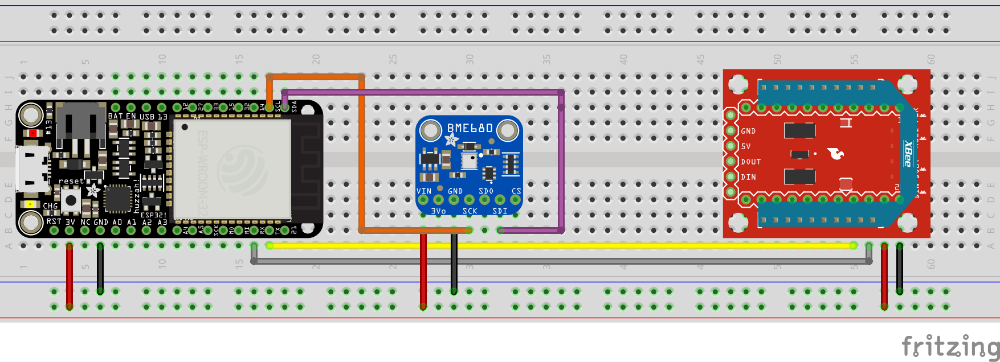

The ESP32 is connected to the XBee via UART and the BME680 via I2C as shown above.
Please note that this varies board to board and the pinout for the board may not be the exact same as shown above.
